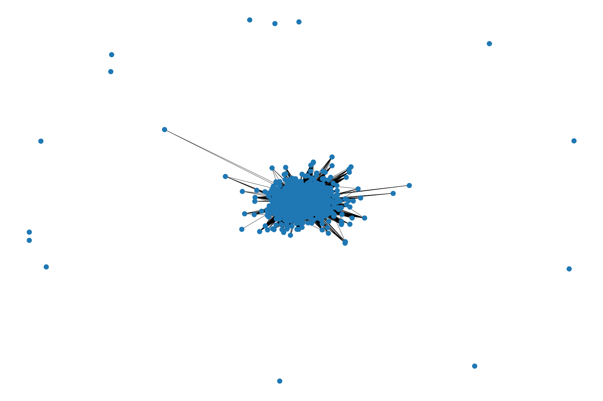
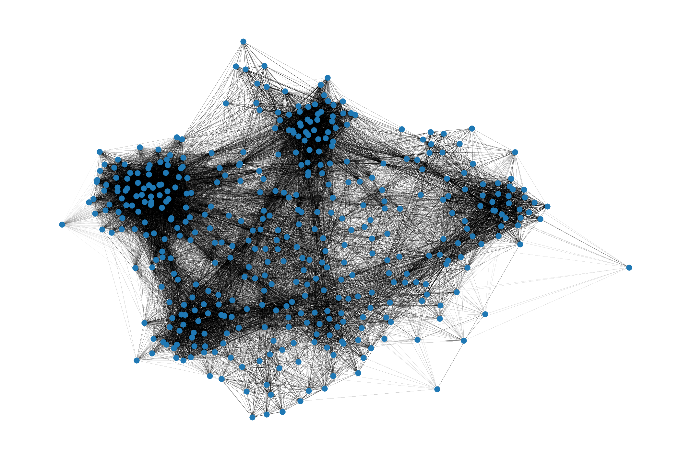
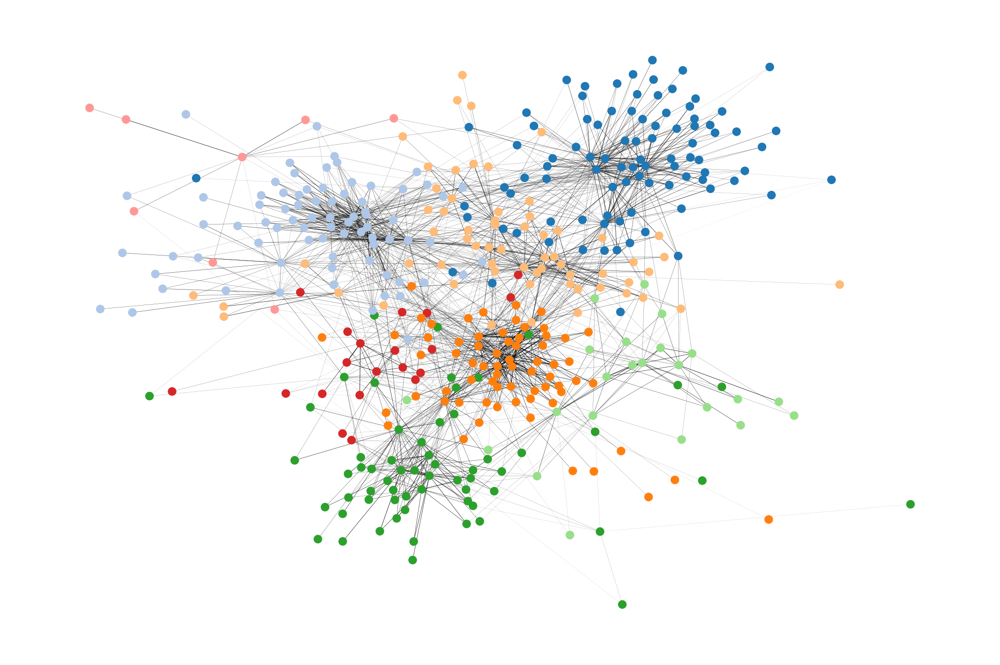

# Projeto 3 – Reproduzindo o Experimento de um Artigo Científico

# Projeto `Reproduzindo parcialmente o paper "Human symptoms–disease network"`
# Project `Reproducing partially the paper "Human symptoms–disease network`

# Apresentação

O presente projeto foi originado no contexto das atividades da disciplina de pós-graduação [*Ciência e Visualização de Dados em Saúde*](https://ds4h.org), oferecida no primeiro semestre de 2022, na Unicamp.

> |Nome  | RA | Especialização|
> |--|--|--|
> | Alan Motta Ganem  | 178777  | Computação|

# Contextualização da Proposta
Esse Trabalho visa reproduzir parcialmente o grafo de sintomas-doenças descrito no artigo "Human symptoms–disease network". O grafo de interação de proteínas não será reproduzido por não disponibilidade direta dos dados
## Ferramentas
Para tal, serão utilizadas bibliotecas de código aberto em python, como:
- [pandas](https://pandas.pydata.org/)
- [scikit-learn](https://scikit-learn.org/stable/)
- [seaborn](https://seaborn.pydata.org/)
- [scipy](https://scipy.org/)
- [NetworkX](https://networkx.org/documentation/stable/index.html)
- [backbone_network](https://github.com/malcolmvr/backbone_network)

As reproduções serão realizadas em notebooks presentes na pasta `notebooks` do projeto

# Metodologia
A fim de reproduzir parcialmente o experimento, a reprodução partirá dos dados de coocorrência de sintomas e doenças do PubMed de acordo com a metodoliga proposta do artigo original. A reprodução seguirá os seguintes passos:

1. Geração de um objeto `Graph` no NetworkX
2. Geração da matrix biadjacência do grafo (dois subconjuntos: doenças e sintomas)
3. Cálculo de fatores de TFIDF
4. Cálculo da significância da conexão utilizando teste chi-quadrado
5. Filtragem das conexões estatisticamente significativas
6. Cálculo da similaridade do cosseno (produto escalar normalizado) entre pares de doenças, utilizando apenas sintomas, doenças e conexões que restaram da etapa 5
7. Criação do grafo espinha dorsal ("backbone") do grafo de similaridade de doenças
8. Indução de outro subgrafo filtrado arestas e nós de acordo com a sua centralidade (não consta no artigo)
9. Detecção de comunidades de doenças (não consta no artigo)
10. Plot dos grafos gerados.

Para realizar o filtro de conexões estatisticamente sifnidicativas, foi criada uma função em python que realiza o teste chi-quadrado para cada par (doença, sintoma) não nulo. O teste ocorre da segunda maneira:
1. é criada uma tabela de contingência em que as colunas representam níveis do sintoma (0 ou 1) e as linhas representam níveis da doença (0 ou 1), os valores em cada célula representa a contagem desses níveis no grafo.
2. é aplicado o teste chi-quadrado implemenetado pelo submódulo `stats` biblioteca `Scipy`

A função calcula o p-valor para cada par (doença, sintoma) não nulo de forma iterativa. Depois disso, são mantidos apenas conexões com p-valor inferior a 0.05.

Feito o calculo da similaridade do cosseno, o grafo de doenças resultane possuia 4219 doenças e 679188 conexões entre elas.

Para gerar a espinha dorsal do grafo, foi utilizado o algoritmo proposto por Serrano et al. 2009. Ainda assim, o subgrafo resultante possuia muitas conexões para plotar(340221).

Não foi possível identificar com muitos detalhes o processo de plotagem do grafo do artigo estudado, por isso, a fim de ter ao menos uma visualização, foi selecionado um subgrafo induzido do grafo de doenças, em que foram selecionados os 422 (aproximadamente 10% dos nós) nós mais centrais de acordo com a centralidade de grau. Após isso, foram selecionadas as 1635 (aproximadamente 10% do numero total de arestas do subgrafo) arestas mais centrais de acordo com centralidade de intermediação.
## Bases Adotadas para o Estudo

* "Suplemenary Data 3" em https://www.nature.com/articles/ncomms5212#MOESM1042

# Resultados e Discussão

Após filtragem de conexões pelo teste chi-quadrado, o grafo resultante possui aproximadamente 56.000 conexões, próximo das 62.820 relatadas no artigo. Como o artigo não trás tantos detalhes de como foi aplicado o método chi-quadrado para seleção de conexões, é possíve que exista uma ligeira diferença entre os métodos e por isso observa-se essa diferença.

Além disso, a implementação utilizada do algoritmo de geração de espinha dorsal do grafo, ainda que utilizando o mesmo valor para $\alpha= 0.05$, o numero de conexões no grafo "backbone" foi de aproximadamente 300.000, um grafo extremamente denso e com muitos nós, como pode ser visto na Figura 1. O artigo relatou um grafo "backbone" com aproximadamente 2.000 conexões, ou seja, aqui certamente houve alguma falha metodológica na reprodução do artigo.

A fim de reproduzir um grafo menos denso, foi utilizada a técnica de seleção de nós e arestas de acordo com sua centralidade, como foi citado na seção de Metodologia. 

O primeiro filtro foi o subgrafo induzido pelos nós com maior centralidade de grau (cerca de 10% dos nós mais centrais). A centralidade de grau e não de intermediação foi escolhida devido sua maior tratabilidade computacional. Como pode-se observar na Digura 2, o grafo ficou muito mais tratável visualmente, podendo inclusive ser verificadas algumas estruturas de comunidades. Entretanto, o numero de arestas ainda foi muito grande, tornando a visualização densa.

Por fim, foram selecionadas as arestas com maior centralidade de intermediação. Como o grafo em que foi aplicada essa métrica de centralidade já estava bastante redusido, tratabilidade computacional não foi um problema. Por fim, foram detectadas as comunidades do grafo usando o algoritmo de Louvain. A estrutura das comunidades e o grafo mais espaço podem ser observados na figura 3

# Evolução do Projeto
A fim de realizar uma reprodução mais fidedigna, uma busca por referências mais aprofundadas dos métodos de análise de redes do artigo poderia ajudar, principalmente no que diz respeito à formação do grafo backbone. Além disso, o filtro de conexões pelo teste chi-quadrado não foi tão bem detalhado no artigo e pode ter acarretado discrepâncias nessa tentativa de reprodução.

Aleḿ disso, a tentativa de reprodução do artigo se restringiu ao grafo de doenças-sintomas, e foi deixado de lado o grafo de interação proteica, bem como a correlação entre ambos, algo que poderia ser tratado em um trabalho futuro.

# Conclusão
É possível concluir que ainda que bem escrito e com métodos relativamente bem descritos e dados abertos, ainda assim pode ser bastante difícil reproduzir resultados de trabalhos científicos de maneira acurada. Uma dos principais responsáveis pode ser a não descrição completa dos métodos utilizados utilizando referẽncias e tratando-se de métodos computacionais, diferentes implementações podem gerar resultados ligeiramente diferentes.

# Referências Bibliográficas

- M. A. Serrano et al. (2009) Extracting the Multiscale Backbone of Complex Weighted Networks. PNAS, 106:16, pp. 6483-6488.
- Zhou, X., Menche, J., Barabási, AL. et al. Human symptoms–disease network. Nat Commun 5, 4212 (2014). https://doi.org/10.1038/ncomms5212