# Projeto 4 – Classificação de lesões de substância branca no Lúpus

O objetivo geral do projeto é, a partir de uma classificador treinado em imagens de ressonância do cérebro para diferenciar lesões isquêmicas e desmielinizantes, identificar qual a etiologia mais provável das lesões presentes em pacientes de Lúpus Eritematoso Sistêmico (LES).

A equipe pode usar qualquer tipo de classificador para a tarefa, desde o SVM já treinado e entregue na Atividade 11, como outro classificador baseado ou não em DL. Os dados de teste não devem ser incorporados no treinamento do classificador.

O conjunto de dados de lesões de pacientes de LES foram compartilhados pelo Google Drive (link nas instruções do P4 no Classroom).

Para o processamento dos dados e treinamento do classificador, sugere-se usar notebooks (e.g., Jupyter).

Se o relatório for feito em um notebook, o modelo a seguir pode ser colocado dentro do notebook diretamente. Nesse caso, coloque no markdown do projeto (fora do notebook) uma cópia dos dados até a seção de `Apresentação` e um link para o notebook com o relatório.

# Modelo Relatório Final de Projeto P4

# Projeto `Classificação de lesões de substância branca no Lúpus utilizando aprendizado topológico e por transferência`
# Project `White matter lesions etiology classification on Lupus with Transfer and Manifold Learning`

# Apresentação

O presente projeto foi originado no contexto das atividades da disciplina de pós-graduação [*Ciência e Visualização de Dados em Saúde*](https://ds4h.org), oferecida no primeiro semestre de 2022, na Unicamp.

 |Nome  | RA | Especialização|
 |--|--|--|
 | Alan Motta Ganem  | 123456  | Computação|

# Introdução
> Apresentação de forma resumida do problema (contexto) e a pergunta que se quer responder.

## Ferramentas

As ferramentas utilizadas serão todas pacotes de código aberto em python, são elas:

1. opencv e PIL - processamento de imagem
2. Keras - extração de features com redes neurais convolucionais pré-treinadas
3. UMAP - redução de dimensionalidade para visualizar o espaço de atributos em duas dimensões
4. Plotly e Seaborn - Visualização interativa de dados
5. Jupyter Lab - Interface interativa do Python
6. Scikit-Learn - Aprendizado de máquinas aplicado às featuers extraidas

## Preparo e uso dos dados

Para o problema em questão não será usada a informação contida nas máscaras das lesões. Será feito dessa maneira pois:

1. O custo de segmentar imagens médicas é muito alto e esse estudo tem também o intuito de contribuir para a redução do custo de diagnóstico de etiologia de lesões de SLE;
2. Algumas das máscaras fornecidas estão incorretas;
3. Acredita-se que os atributos extraidos pela rede neural são capasez de assinalar a região de interesse do cérebro.

Para análise, serão utilizadas todas as imagens que possuem mascara, isso é, que possuem algum indicativo de que há umalesão nela. Isso inclusive pode incluir viéses nos algoritmos supervisionados.

Na figura abaixo, a distribuição de flairs (consequentemente o tamanho da porção do cérebro na imagem) não é a mesma para todas as classes qunado fitramos apenas as imagens que possuem mascara, o que pode gerar uma correlação espuria aprendida pelo modelo. 

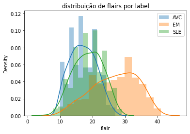

Abaixo, temos a mesma distribuição, mas sem os filtros de mascara.É possível observar que as imagens de EM possuem uma distribuição mais alargada, ou seja, possui flairs em um range maior, o que pode indicar uma diferente técnica de captação para essas imagens, o que mais uma vez, pode acarretar em viéses nos métodos de análise.

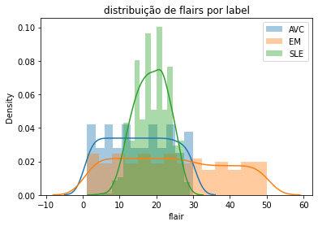

As imagens são normalizadas usando o método min-max, fazendo com que o valor de seus pixels fiquem entre 0 e 255.
Além disso, as imagens são modificadas para ficarem no tamanho (299,299), a fim de satisfazer os requerimentos
para extração de features. Além disso, as imagens preto e branco são transformadas para o formato RGB com 3 canais, a fim de satisfazer os critérios de input da rede extratora de features [EfficientNetV2](https://keras.io/api/applications/efficientnet_v2/#efficientnetv2s-function).

A arquitetura selecionada gera aproximadamente 1200 atributos por imagem. Desse modo, a "seleção" de features será feita na etapa 4 descrita na seção `Metodologia`, onde um algoritmo supervisionado irá escalar o espaço (dar peso às features mais determinantes na tarefa de separação de classes) que posteriormente será reduzido a dimensionalidade utilizando o UMAP.

# Metodologia
A Transferência de Aprendizado (`Transfer Learning`) no contexto de imagens médicas é [bastante utilizado](https://learnopencv.com/transfer-learning-for-medical-images/) pela comunidade. Essa técnica se mostra bastante interessante devido ao fato de trazer o poder de extração de features das redes neurais profundas sem que seja necessário um grande volume de dados do contexto específico, o que é bem comum no contexto de imagens médicas, onde a aquisição e rotulação de dados pode ser muito custosa.

O Aprendizado topológico (ou [`Manifold Learning`](https://scikit-learn.org/stable/modules/manifold.html)) é uma area que estuda a redução de dimensionalidade não linear de um conjunto de dados.

O Aprendizado topológico será especialmente importante no nosso trabalho pois:

1. Possuimos um espaço de atributos esparso e de alta dimensionalidade ($\approx$1200)
2. Nosso objetivo de modelagem não possui rótulos, o que faz com que tenhamos um problema semi-supervisionado. Para definir a melhor abordagem, é necessário poder visualizar a topologia do espaço de atributos para identificar padrões sem a necessidade de labels.

A análise inicial para definir a estratégia de classificação consiste em:

1. Reduzir a dimensionalidade dos atributos extraidos pela arquitetura `EfficientNetV2` treinada do dataset `ImageNet`;
2. Plotar a dispersão dos pontos que são a representação bidimensional do espaço de feature para cada imagem;
3. Tentar identificar algum padrão que indique separação no espaço de features entre subgrupos de imagens de SLE (o que pode significar diferentes etiologias)
4. Testar a consistência dessa separação escalando o espaço de features com os pesos de um classificador supervisionado (SLE vs AVC). Essa etapa garante que mesmo escalando o espaço de features de modo a maximizar a separação entre classes, os elementos topológicos fortenemente conexos ainda permanecem.
5. Utilizar um algoritmo de K-vizinhos (20 vizinhos e distancia euclideana) para identificar rotulos de SLE que estão misturados com rotulos de AVC e os que estão isolados. Isso irá definir uma pseudo-etiologia (uma vez que não sabemos a label real) da lesão.
6. Fazer uma análise visual e qualitativa dos resultados

Essa técnica remonta a ideia de aprendizado semi-supervisionado, só que nesse caso, não possuimos nenhum rótulo da classe de interesse (etiologia da lesão de SLE), apenas rótulos de classes auxiliares na etapa de aprendizado (especificamente na etapa de escalar o espaço de features de maneira supervisionada, descrito na etapa 4).

Por fim, é feita uma análise qualitativa das imagens próximas em cada cluster.

Como queremos encontrar a diversidade de labels na vizinhança local, o algoritmo mais competente para tal função é o de K-vizinhos, em que buscaremos os pontos mais proximos na vizinhança de uma imagem e estimaremos a sua etiologia de acordo com o grau de diversidade da vizinhança. Mais diverso significa a presença de imagens de AVC, o que indica etiologia isquemica. Pontos isolados irão indicar etiologia desmielinizante.

Como não possuimos labels, não haverá validação quantitativa dos reusltados, apenas qualitativa.

# Resultados Obtidos e Discussão

Ao reduzir a dimensionalidade das features extraidas, obetmos o seguinte gráfico de dispersão:

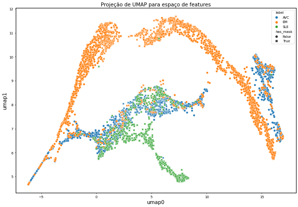

É possível obserar que há uma separação significativa das labels, sem nem antes escalar o espaço de features para dar mais peso as featues importantes.
Além disso, é possível observar duas regiões de SLE, uma que se mistura com AVC e outra que se encontra isolada. Esse é o tipo de padrão de separação topológica que pode nos ajudar a identificar padrões sem que hajam labels, olhando apenas para o espaço de features. Outro ponto importante é que as imagens de SLE que estão distantes de AVC não estão próximas das imagens de EM, o que pode indicar uma etiologia que se manifesta de maneira semelhante a AVC no quadro isquemico, mas diferente de EM no quadro desmielinizante.

É interessante observar também que flairs próximas ficam também próximas no espaço de features, já que são imagens parecidas em termos do tamanho da seção transversal da imagem.

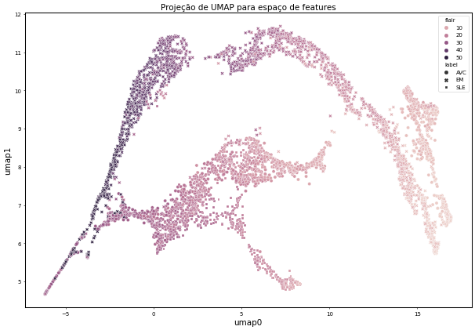

Isso nos dá confiança de que os atributos extraidos pela rede neural de fato fazem sentido e podem ser interpretados de alguma maneira.

A partir desse ponto, iremos escalar o espaço de features, dando pesos maiores para features que são mais relevantes em separar as classes SLE e AVC. Esses pesos serão dados através de uma regressão Lasso, já que ela tenta reforçar a esparsidade. Isso é importante pois temos aproximadamente 1200 features extraidas.

Ao treinar o modelo lasso, podemos observar pelo pico centrado no zero na distribuição abaixo, que de fato os parametros do modelo são esparsos.

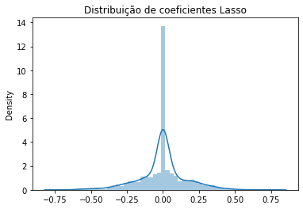

Após multiplicar as features extraidas pelos seus pesos, obtemos uma topologia muito próxima da original, como vemos abaixo:

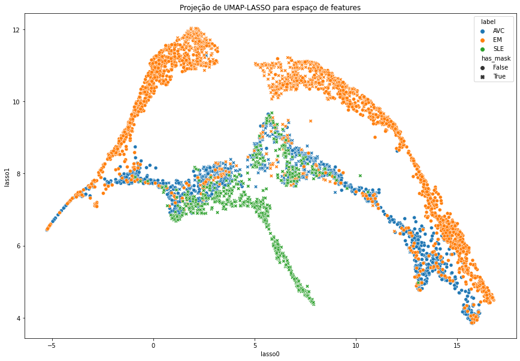

A nova imagem parece um pouco mais comprimida, isso é, pontos já próximos ficaram ainda mais próximos, um efeito dos pesos aprendidos.

Agora iremos fitar um modelo KNN para tentarmos separar as regiões de pseudo-etiologias (pseudo pois não sabemos a label real) observadas nos pontos verdes, que representam imagems de lesão de SLE.

Plotando agora o gráfico dando enfase de cor de acordo com as probabilidades ed AVC obtidas, podemos observar que o nosso modelo KNN conseguiu com sucesso selecionar a região do espaço que acreditamos estar associado a uma etiologia desmielinizante (região mais clara do gráfico, com probabilidade próxima de zero):

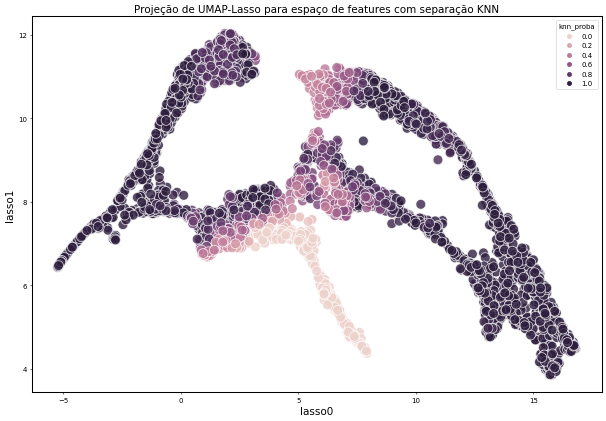

Todavia, estamos olhando para multiplas imagens do mesmo paciente, de flairs distintos. A fim de garantir que nossa estratégia é consistente, iremos agregar todas as probabilidades de um mesmo paciente e determinar um split ótimo de probabildiade de KNN que nos dará um split entre duas etiologias diferentes.

Um split seguro entre etiologias pode ser feito com o threshold de probabilidade próximo de 0.3, onde existe um gap claro entre distribuições como sugere o gráfico abaixo:

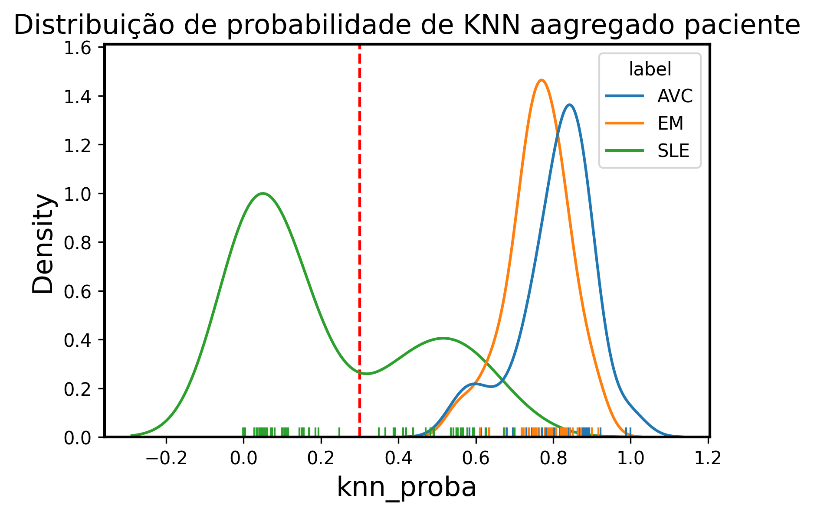

Ou seja, toda agregação de imagens de um mesmo paciente com SLE com probabilidade média menor que 30% de pertencer à classe AVC será considerado um caso de etiologia desmielinizante. Um ponto interessante que deve-se salientar é que o knn não tem acesso as labels de EM e por isso classifica elas como AVC. Isso é interessante pois mostra que as pseudo-etiologias desmielinizantes para SLE estão distantes de AVC no espaço de features, mas estão também distantes de EM, o que indica uma manifestação diferente de EM!

A fim de ver como essas agregações se comportam no espaço reduzido de dimensões, calcula-se o centroide nesse espaço para cada conjunto de imagens de um mesmo paciente, obtendo-se o seguinte gráfico de dispersão:

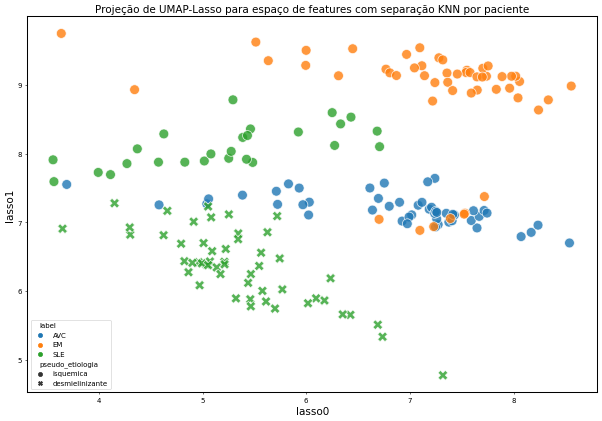

A separação observada entre os conjuntos de SLE isquemico e AVC provavelmente se deve ao fato de estarmos calculando os centroides levando em conta imagens sem mascara, ou seja sem lesão. A fim de verificar se a agregação é consistente nesses dois grupos, fazemos o mesmo plot, porem utilizando apenas as imagens mascaradas (que contem informação da lesão) dos pacientes, obtendo o seguinte gráfico:

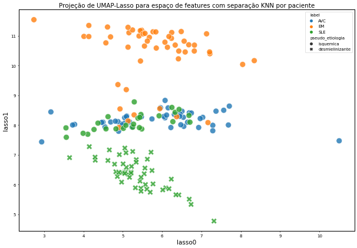

É possível observar que a topologia resultante é muito semelhante a anterior, porém os conjuntos de AVC e SLE isquemico votam a se sobrepor, uma vez excluido o ruido das imagens que não contém mascara.

Por fim, uma análise qualitativa é feita utilizando o output do modelo KNN, tentando identificar para quatro grupos os aspecetos qualitativos que os definem. São os quatro grupos:

1. pseudo-etiologia isquemica tendendo para isquemica
2. pseudo-etiologia desmielinizante tendendo para isquemica
3. pseudo-etiologia isquemica tendendo para desmielinizante
4. pseudo-etiologia desmielinizante tendendo para desmielinizante

O conjunto de imagens são mostradas abaixo

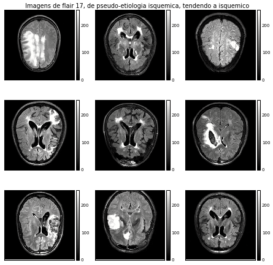
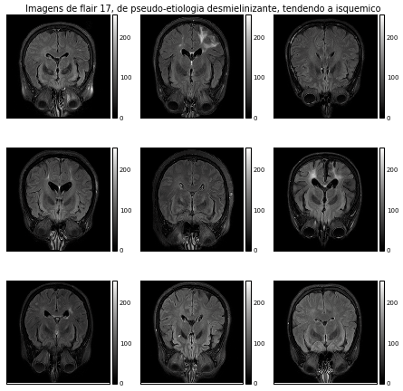
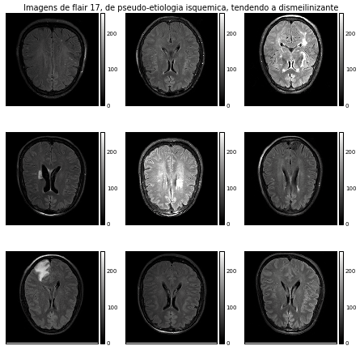
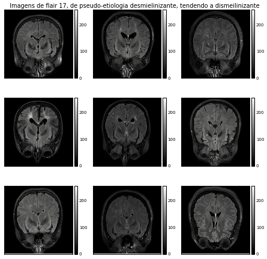

É possível observar que de modo geral, a tendência isquemica diz respeito a lesões com brilho maior, maior volume, mais pronunciadas e mais próximas da região central. Já no caso das dismielinizantes, temos lesões menos brilhosas, mais discretas e dispersas por regiões distintas do cérebro.

# Conclusão
Com esse trabalho foi possível definir uma forma de separar pseudo-etiologias em um conjunto de dados em que não se sabe a etiologia real de imagens de lesões cerebrais em pacientes de SLE.

Pode-se concluir que com auxilio do aprendizado topológico, os atributos extraidos por uma rede neural profunda pré treinada podem se tornar bastante expressívos e pode nos auxiliar em tarefas não supervisionadas e semi sueprvisionadas.

Por fim, é importante resaltar que a validação final dos resultados deve passar pelo crivo de um profissional da área de saúde com expertise no contexto proposto.
# Referências Bibliográficas

